# ☕ CrowdBrew: AI Marketing Manager for Local Cafés

<p align="center">
  
</p>

> **Turning Local Events into Revenue with Real-Time Marketing, Multi-Agent Intelligence & Gemini.**


**CrowdBrew** is an intelligent multi-agent system designed to act as a marketing strategist for independent cafés. It researches local events (in Łódź, Poland), evaluates their business potential using a custom **Impact Score**, and generates ready-to-publish promotional content (thematic menus & social media posts).

This project was developed as a Capstone for the **Google AI Agents Intensive (2025)** in the *Enterprise Agents* track.

## 📸 See it in Action

[](https://youtu.be/A3xpKf92_3A)

**Note:**
Please note that due to the local nature of the application (for the city of Łódź, Poland) and the need to communicate with the model in Polish to achieve the best possible results, the user interface is in Polish. However, this application can be easily adapted to other locations by changing the language of the agent instructions and the UI.

### **User input section:**


### **Agent work results:**


### **Output justification and Explainable AI example:**


---

## 🏗️ Architecture

CrowdBrew utilizes the **Google Agent Development Kit (ADK)** to orchestrate a sequential pipeline of three specialized agents, ensuring a logical flow from data gathering to creative execution.

```mermaid
graph TD
    User([👤 User Input: Date]) -->|Async Request| Main[Main Controller]
    Main -->|Task: Find Events| Agent1[🕵️ Research Agent]
    Agent1 -->|Tool: Google Search| Web((🌐 Internet))
    Web -->|Raw Event Data| Agent1
    Agent1 -->|Confirmed Events List| Agent2[🧠 Impact Agent]
    
    subgraph "Reasoning Core (The Brain)"
    Agent2 -->|Analyze Audience, Footfall and Scores| Logic{In top 3 Impact Scores?}
    Logic -- Yes --> Agent3
    Logic -- No --> Discard[🗑️ Discard Event]
    end
    
    Agent3[🎨 Marketing Agent] -->|Generate Content| Bundle[📝 Menu + Facebook Post]
    Bundle -->|JSON Structure| DB[(🗄️ SQLite Database)]
    DB -->|Persisted Data| UI[📊 Streamlit Dashboard]
    Agent3[🎨 Marketing Agent] -->|Passing scores and justification from Impact Agent| UI[📊 Streamlit Dashboard]
```



**Technology Stack:**

* **Core Framework:** Google ADK (Python) for agent orchestration.
* **Brain:** Google Gemini 2.5 Flash Lite (chosen for speed and reasoning capabilities).
* **Database:** SQLite for persisting generated events.
* **Interface:** Streamlit (with async implementation for responsive UI).
* **Infrastructure:** Docker (fully containerized for reproducible deployment).

#### The system mimics a human marketing team:

1.  **🕵️‍♂️ Agent 1: The Researcher (The Scout)**
    * **Role:** Uses `Google Search` tools to scan the web for events in Łódź on a specific date. It filters out noise and identifies confirmed details.
2.  **🧠 Agent 2: The Strategist (Impact Analysis)**
    * **Role:** This is the system’s “brain.” It analyzes the event list and assigns an Impact Score (0–100) based on five criteria (0–20 pts each):
      * past attendance at similar events,
      * event scale and prestige (favoring large, premium events),
      * alignment with the café’s profile and customer potential,
      * audience breadth and diversity,
      * overall tone of the event (positive/negative, optimistic).
3.  **🎨 Agent 3: The Creative (Content Gen)**
    * **Role:** Takes the winning events and generates a "Marketing Bundle": a thematic menu item (e.g., "Jazz Espresso" and "Saxophone Cookies") and a ready-to-post social media caption.
  
### 🤖 The Agent Team

| Agent Name          | Role           | Responsibility                                                               | Tools / Logic                        |
| :------------------ | :------------- | :--------------------------------------------------------------------------- | :----------------------------------- |
| **Research Agent**  | The Scout      | Scours the web for confirmed events and holidays in Łódź on a specific date. | `Google Search`                      |
| **Impact Agent**    | The Strategist | Evaluates events based on business potential (footfall, fit, reach).         | **Impact Score** Algorithm (0-100) & `Google Search` for additional verification  |
| **Marketing Agent** | The Creative   | Creates thematic content connecting the event to the café's offer.           | Contextual Content Gen (Menu + Copy) |

---

## 🚀 Installation & Setup

You can run CrowdBrew either using Docker (recommended for reproducibility) or a local Python environment.

### Prerequisites
1.  **Google Cloud API Key** (with access to Gemini models).
2.  **Git** installed.

### 🔐 1. Configuration (Required)
Create a `.env` file in the root directory of the project. **Do not share this file.**

```env
GOOGLE_API_KEY=your_actual_api_key_here
```

### 🐳 2. Running with Docker (Recommended)
This method ensures the environment (OS, libraries) matches the development conditions exactly.

1.  **Build the image:**
    ```bash
    docker build -t crowdbrew .
    ```

2.  **Run the container:**
    *Note: I pass the .env file to the container so you don't have to hardcode keys.*
    ```bash
    docker run -it --rm -p 8501:8501 --env-file .env -v ${PWD}/data:/app/data crowdbrew
    ```

3.  **Access the App:**
    Open your browser and go to `http://localhost:8501`.

### 🐍 3. Running Locally (Python 3.11)

1.  **Create a virtual environment:**
    ```bash
    python -m venv venv
    source venv/bin/activate  # On Windows: venv\Scripts\activate
    ```

2.  **Install dependencies:**
    ```bash
    pip install -r requirements.txt
    ```

3.  **Run the application:**
    ```bash
    streamlit run streamlit_app.py
    ```

---

## 🧪 Testing & Observability

This project implements **Explainable AI** principles. Tools to verify agent reasoning and ensure JSON structural integrity are included.

### Evaluation Script
A standalone script (`evaluate.py`) to test the agent pipeline without the UI is provided. This is useful for CI/CD or quick sanity checks.

```bash
python evaluate.py
```
* **Function:** Simulates a request, validates the JSON output structure, and verifies that the "Impact Score" logic is applied.
* **Logs:** Generates execution logs in the `evaluation_logs/` directory.

### Trace Logging
To monitor the work and course of LLM processes.
* **File:** `evaluation_logs/agent_trace.log`
* **Content:**
  * Currently: General information about the agent's lifecycle (INFO LOG LEVEL). 
  * Optional: 
    * Full LLM Prompts, Detailed API responses from services, Internal state transitions and variable values (DEBUG LOG LEVEL).
    * Use of deprecated methods or parameters, Non-critical errors that the system recovered from (WARNING LOG LEVEL).
    * Failed API calls to external services, Unhandled exceptions during agent execution, Configuration errors (ERROR LOG LEVEL).

```python
logging.basicConfig(
    level=logging.INFO,
    filename=os.path.join(LOG_DIR, 'agent_trace.log'),
    filemode='w',
    format='%(asctime)s - %(name)s - %(levelname)s - %(message)s')
```

**Note:** It is recommended to use INFO or WARNING in production environments. Only enable DEBUG when actively troubleshooting an issue, as DEBUG logs can be very verbose and may contain sensitive information.

---

## 📂 Project Structure

```text
crowdbrew/
├── crowdbrew_agent/       # Core Logic Module
│   ├── agent.py           # Agent definitions (Prompts, Model & Pipeline)
│   ├── database.py        # SQLite handler (Event persistence)
│   └── __init__.py
├── evaluation_logs/       # Generated trace logs (Excluded in git - only sample logs in the repository)
├── data/                  # SQLite Database storage
├── main.py                # Main controller / Business Logic
├── streamlit_app.py       # Frontend (Streamlit UI)
├── evaluate.py            # QA & Evaluation Script
├── Dockerfile             # Container configuration
├── requirements.txt       # Python dependencies
├── .gitignore             # Git exclusions
├── .dockerignore          # Docker build exclusions
└── .env                   # Environment-specific configuration variables file (needed to be created)
```

---
## 🔧 Troubleshooting

* **Google Search API Error:** Ensure your API key has "Search" permissions enabled in Google Cloud Console.
* **Docker Connection Refused:** If the Streamlit UI doesn't load, make sure port `8501` is not occupied by another service or check your Docker mapping (`-p 8501:8501`).
* **Service unavailibility:** When working with LLMs, you may encounter transient errors like rate limits or temporary service unavailability. Retry options automatically handle these failures by retrying the request with exponential backoff, but it some cases it may not be sufficient. In that case please try again a little bit later.

## ☁️ Deployment Note
This application is **Cloud Run Ready**. The `Dockerfile` is optimized (`python:3.11-slim`) and listens on port `8501`, making it compatible with serverless container platforms like Google Cloud Run.

## 📄 License
This project is licensed under the **Creative Commons Attribution-ShareAlike 4.0 International (CC BY-SA 4.0)**.
See the [LICENSE](https://creativecommons.org/licenses/by-sa/4.0/) file for details.
